# DelDOT GeoTrak — User Guide (plain English)

**What is GeoTrak?**  
A map tool for DelDOT Materials & Research that helps you **screen** a site before you spend money on field tests. It shows soils, geology, nearby borings, water depth, and a **planning** infiltration rate. It also helps draft a **Soil Boring Request** sheet.

**What it is not**  
It is **not** a sealed geotechnical report, **not** an approved DNREC design infiltration rate, and **not** a Phase I ESA. A PE still decides design. Field ASTM tests still control App.1 infiltration design.

| | |
|---|---|
| **Hosted app (sign-in works here)** | https://m3nos95.github.io/Geotrack/geotrak/ |
| **LabTrak (sample tracking)** | https://m3nos95.github.io/Geotrack/ |
| **This file’s app** | `Geo_Report_Center.html` in this folder |
| **Feature tour (demo someone)** | **[FEATURE_TOUR.md](./FEATURE_TOUR.md)** — click-by-click: Septic, DGS, project limits, boring request, checklist |

> **Don’t turn someone loose on the map cold.** Use the [Feature tour](./FEATURE_TOUR.md): click a point → walk the left Site Intel tabs (Septic = perc tests, DGS = wells + PDF links, Infil = how the rate was built) → draw project limits → try a boring request.

> **Screenshots:** Real UI captures live under `docs/readme-screenshots/`. The screen looks fuller after you open a project folder with `refs/` and `db.json`.

---

## Quick start (5 minutes)

1. Open https://m3nos95.github.io/Geotrack/geotrak/ in Chrome or Edge (**not** a downloaded double-clicked file).
2. Sign in with your LabTrak / Supabase email and password  
   (or **Create account**, or **Connection settings → Reset to LabTrak project** if login fails).
3. Click **I understand — continue** on the disclaimer if it appears.
4. Click **Open project folder** and choose your local GeoTrak project folder (the one with `refs/` and `db.json`).
5. Turn **Estimates** **ON** in the top bar when you want screening rates.
6. Click the map → read **Site Intel** on the left — start with **Site**, **Septic**, **DGS**, **Borings**, **Hydro**, then **Infil**.

Without a local project folder, the map still works, but most soils / borings / rates will be empty.

---

## Show someone the features (2-minute script)

| Step | Click | Tell them |
|------|-------|-----------|
| 1 | Map point | “Everything on the left is about **this** spot.” |
| 2 | **Septic** | “These are DNREC **perc tests** in the search radius — real records, not a guess.” |
| 3 | **DGS** | “DGS wells — open the **PDF / lith / geophys** link when it’s there.” |
| 4 | **Borings** | “Nearby DelDOT borings and lab snippets.” |
| 5 | **Infil** (Estimates ON) | “Planning rate + plain-English story of how it was blended. Not sealed design.” |
| 6 | **Draw limits** → Analyze | “Polygon around the job → inventory, best screening cell, short site summary.” |
| 7 | Top bar **Borings** | “Drafts the official M&R boring request sheet from purpose (bridge, pole, SWM…).” |

Full checklist and talking points: **[FEATURE_TOUR.md](./FEATURE_TOUR.md)**

---

## Big ideas (layman)

| Term | Plain meaning |
|------|----------------|
| **Screening** | Early “looks about right” guess for planning — not final design. |
| **Infiltration rate (in/hr)** | How fast water sinks into the ground. Higher = sandier / faster. |
| **Screening estimate** | GeoTrak’s blended guess of a field-scale rate. |
| **Illustrative design (÷ 2.5)** | Screening ÷ FoS 2.5 for **cased borehole / undersized ring** planning. Preferred DNREC method is a **full-size ring** field test — that path does **not** use this ÷2.5 as the approved rate. |
| **FoS 2.5** | Factor of safety from DNREC BMP Appendix 1 for certain borehole-style tests. |
| **HYDGRP (A/B/C/D)** | NRCS drainage group. A drains fast; D drains poorly. |
| **Site DNA** | Fingerprint of a spot: drainage group + geology + recharge class. Similar fingerprints elsewhere can “lend” typical lab behavior. |
| **Field anchors** | Real DelDOT borehole infiltration tests (amber diamonds). Strongest truth when nearby. |
| **Estimates OFF** | Map facts only (soils, geology, borings). No screening rates. |
| **Estimates ON** | Unlocks screening rates, class/column profiles, DNA mids, eng. props. |

---

## 1. Sign-in screen

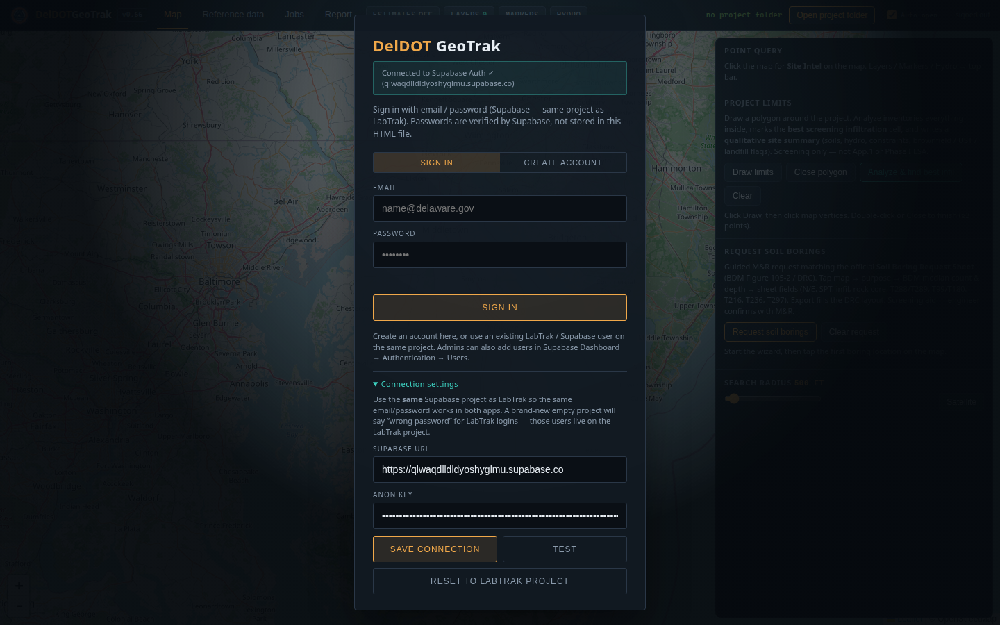

| Box / button | What it means | What you do |
|--------------|---------------|-------------|
| **DelDOT GeoTrak** | App title | — |
| Connection status (teal) | Can the browser reach Supabase? | If it fails, open Connection settings |
| **SIGN IN / CREATE ACCOUNT** | Two modes | Pick one |
| **EMAIL** | Your login | Work email |
| **PASSWORD** | Your password (checked by Supabase — not stored in the HTML) | Type password |
| **Confirm password** | Create-account only | Type again |
| **SIGN IN / CREATE ACCOUNT** (button) | Submit | Click |
| **Connection settings** | Point GeoTrak at the right Supabase project | Expand if login fails |
| **Supabase URL** | Project web address (`https://xxxxx.supabase.co`) | Must match LabTrak’s project for shared logins |
| **Anon key** | Public browser key from Supabase → Project Settings → API Keys | Paste `anon` `public` key (never `service_role`) |
| **Save connection** | Remember URL + key in this browser | Click after pasting |
| **Test** | Ping Supabase | Should say Connected ✓ |
| **Reset to LabTrak project** | Put back the shared LabTrak Supabase project | Use this if you pointed at a new empty project and passwords “don’t work” |

**Important:** LabTrak and GeoTrak should use the **same** Supabase project so the same email/password works in both. A brand-new empty project will say “wrong password” for old LabTrak users.

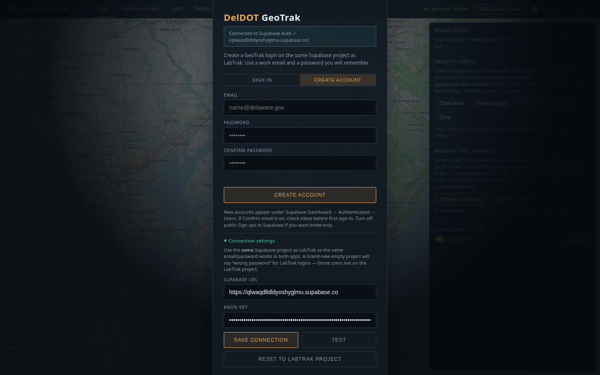

---

## 2. Top bar (always visible)

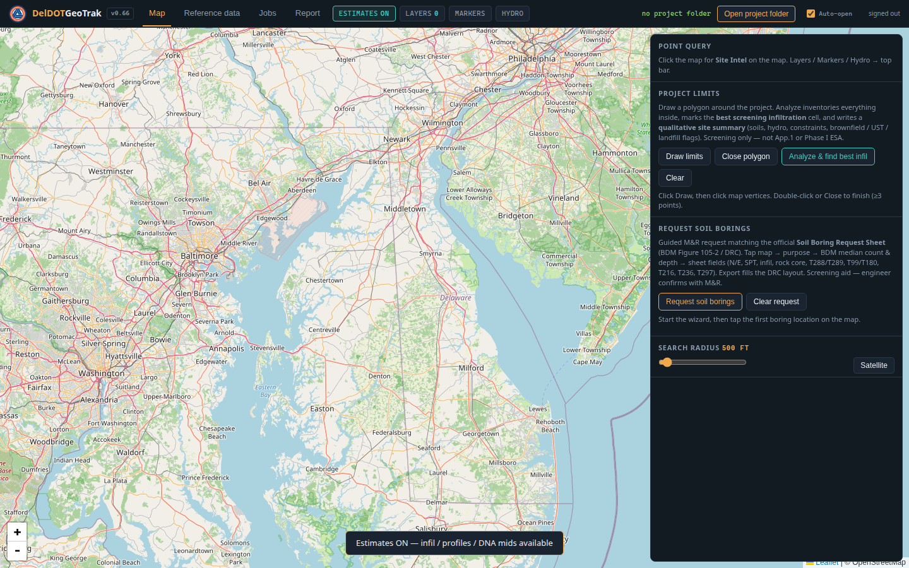

### Page tabs

| Tab | What it is |
|-----|------------|
| **Map** | Main map + Site Intel + project limits + boring request |
| **Reference data** | Load geology/soils GeoJSON, manage layers, boring database |
| **Jobs** | Import a lab Summary.xls + coordinates into the boring DB |
| **Report** | Draft Word memos (geo report / DNREC soil investigation) |

### Toolbar buttons

| Button | What it means | What you do |
|--------|---------------|-------------|
| **Estimates ON/OFF** | Master switch for screening numbers | Leave OFF for “facts only”; turn ON for rates/profiles |
| **Layers** | Which reference layers feed Site Intel | Open → filter / All on / All off / Expand… |
| **Markers** | Map dots | Toggle DGS wells (usually off) and infil anchors (usually on) |
| **Hydro** | Online water-table / aquifer / climate options | Turn online sampling on when you have internet |

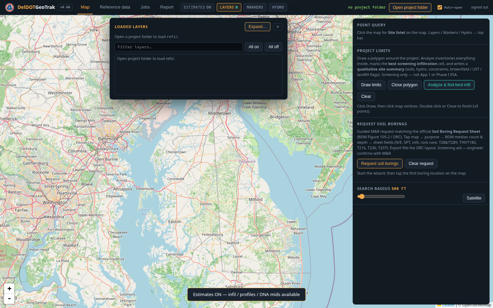
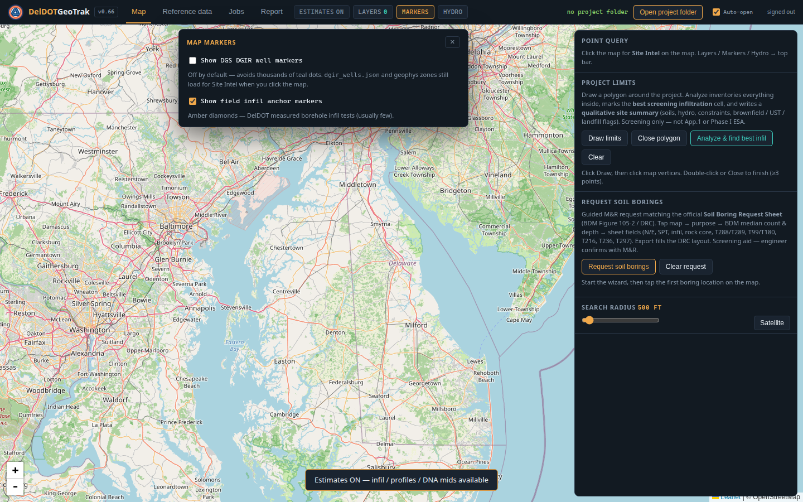
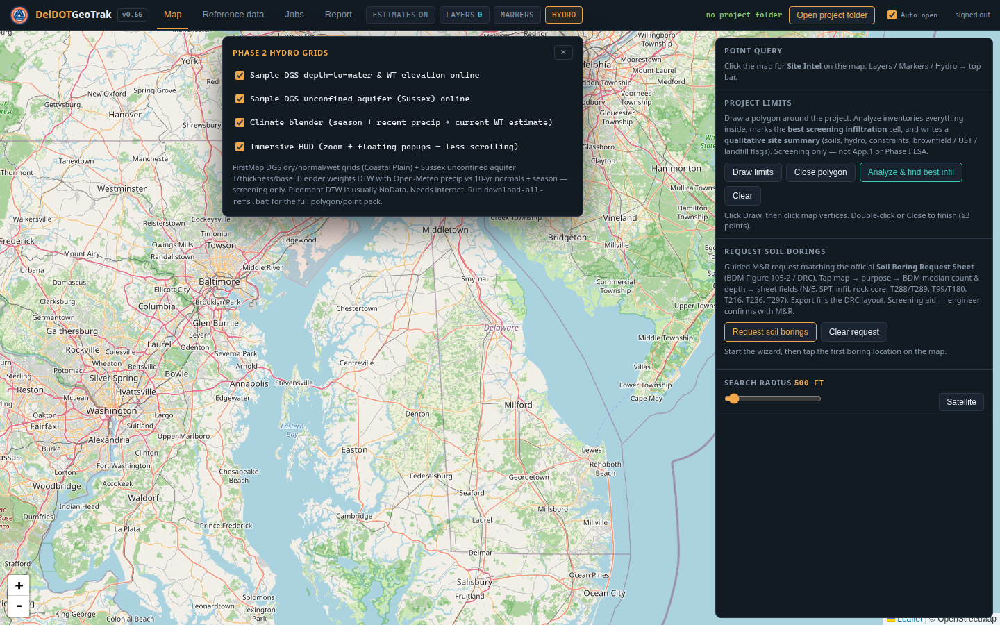

### Project / account

| Box | What it means | What you do |
|-----|---------------|-------------|
| **no project folder** (or folder name) | Whether local files are loaded | — |
| **Open project folder** | Load `refs/*.geojson` + `db.json` from disk | Click and pick the folder (Chrome/Edge) |
| **Auto-open** | Remember last folder next time | Keep checked if you always use the same folder |
| **signed in / signed out** | Supabase session | **Sign out** when done |

---

## 3. Map page — right rail tools

These sit on the right of the Map tab.

### Point query
| Box | Meaning |
|-----|---------|
| Hint text | Click the map to open **Site Intel** |

### Project limits
| Box / button | Meaning | What you do |
|--------------|---------|-------------|
| Explanation | Draw a polygon around the job; GeoTrak inventories what’s inside and marks a **best screening infiltration** cell | Screening only — not App.1 design or Phase I |
| **Draw limits** | Start drawing | Click, then click vertices on the map |
| **Close polygon** | Finish the shape | Or double-click (≥3 points) |
| **Analyze & find best infil** | Score cells inside the polygon | Needs **Estimates ON** |
| **Clear** | Remove the polygon / results | Click |

### Request soil borings
| Box / button | Meaning | What you do |
|--------------|---------|-------------|
| Explanation | Guided draft of DelDOT’s **Soil Boring Request Sheet** (BDM Fig. 105-2) | Engineer still confirms with M&R |
| **Request soil borings** | Start wizard | Click, then tap boring locations on the map |
| Purpose picker | Bridge abutment, pole, infiltration BMP, roadway, etc. | Pick what you’re designing |
| Depth / count / tests | Suggested from BDM medians + purpose | Review; rock coring is purpose-gated (e.g. none for SWM) |
| Sheet fields | Contact, SPT continuous depth, infil Y/N, rock core ft, lab tests | Edit yellow/needed fields; T288 (pH) and T99 (Proctor) stay unchecked unless you ask |
| Export / print | Fill the DRC layout | Download or print for M&R |
| **Clear request** | Wipe the draft request | Click |

### Search radius & basemap
| Box | Meaning | What you do |
|-----|---------|-------------|
| **Search radius** (e.g. 500 ft) | How far to look for nearby borings / septic / anchors | Drag slider |
| **Satellite** | Switch basemap | Click |

---

## 4. Site Intel (after you click the map)

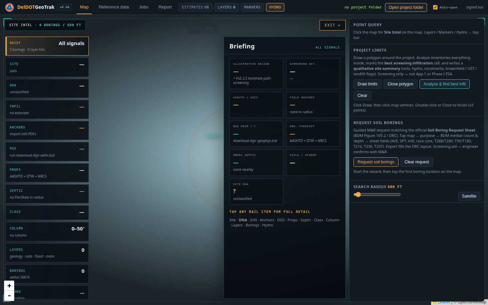

Left = **rail** (pick a topic). Center/right drawer = details. **Exit** closes Site Intel.

| Rail tab | What that box means | What you’ll see |
|----------|---------------------|-----------------|
| **Brief** | One-page snapshot | Design/screening infil (if Estimates ON), class, neighbors, hydro |
| **Site** | Mapped ground at the click | Soil name/symbol, HYDGRP, geology, recharge, WRPA, NRCS bits |
| **DNA** | “Fingerprint” of the spot + relatives | Same HYDGRP\|geology\|recharge family elsewhere; soft phenotype transfer when exact cells are thin |
| **Infil** | Screening infiltration story | Rates, “How we arrived at this rate”, contribution sliders |
| **Anchors** | Measured DelDOT borehole infil tests | Amber diamonds; measured in/hr and design ÷FoS |
| **DGS** | Delaware Geological Survey wells / geophys | Lith / gamma links; shallow coarse/fine classes |
| **Props** | Screening engineering properties | Subgrade / frost / drainage-style priors from AASHTO — not lab CBR |
| **Septic** | DNREC PercRate points nearby | Minutes/inch converted for screening (not App.1 ASTM) |
| **Class** | AASHTO / USCS at the point | From nearby borings or NRCS fallback (Estimates ON) |
| **Column** | Stick log 0–50′ (and deeper subsurface mode) | Layered class with depth (Estimates ON) |
| **Layers** | Which polygons hit this click | Flood, wetland, GMZ, wellhead, soils, geology, etc. |
| **Borings** | Nearby DelDOT borings in the search radius | Click a row for a snippet |
| **Hydro** | Depth to water / water-table elevation | Dry / normal / wet; optional “current” climate blend; App.1 2-ft separation check |

### Infiltration box (most important screening panel)

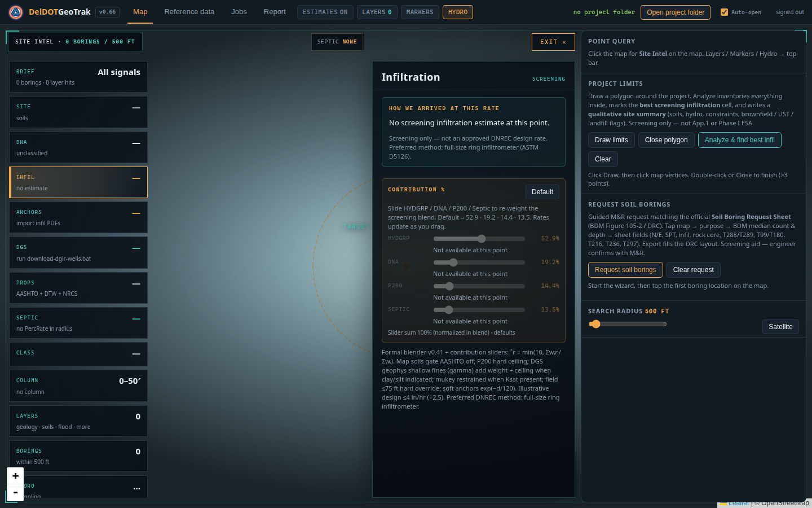

| Piece | Plain meaning |
|-------|----------------|
| **How we arrived at this rate** | English walkthrough: soils → blend shares → caps → groundwater separation → ÷FoS design |
| **Screening est. (in/hr)** | Blended planning rate |
| **Illustrative ÷2.5** | Borehole-path planning design number (withheld if water is too shallow) |
| **Contribution % sliders** | Re-weight HYDGRP / DNA / P200 / Septic in the blend | Drag to explore sensitivity; **Default** restores 52.9 / 19.2 / 14.4 / 13.5 |
| Field / geophys / caps notes | Hard rules (nearby field test override, fines ceiling, etc.) | Read before trusting a high rate |

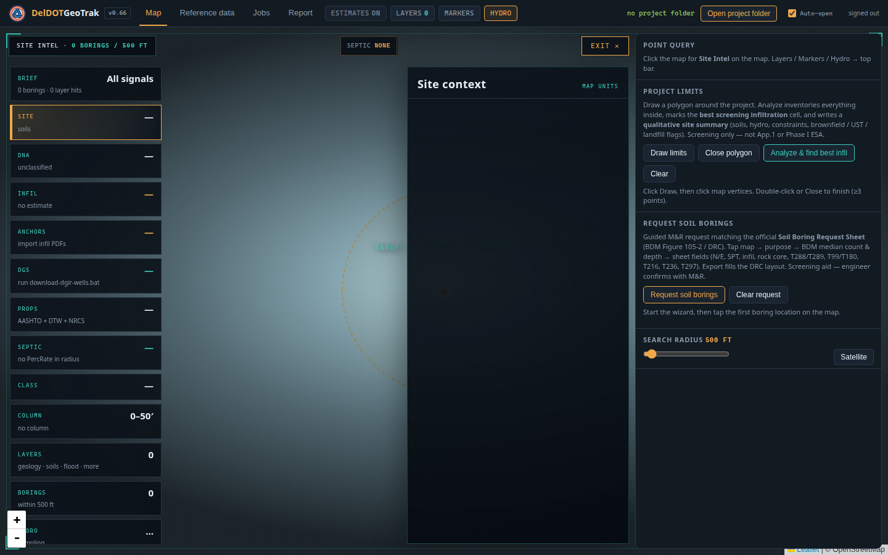
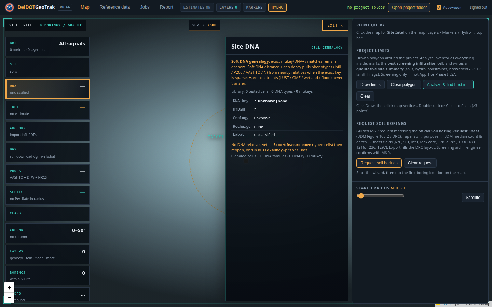
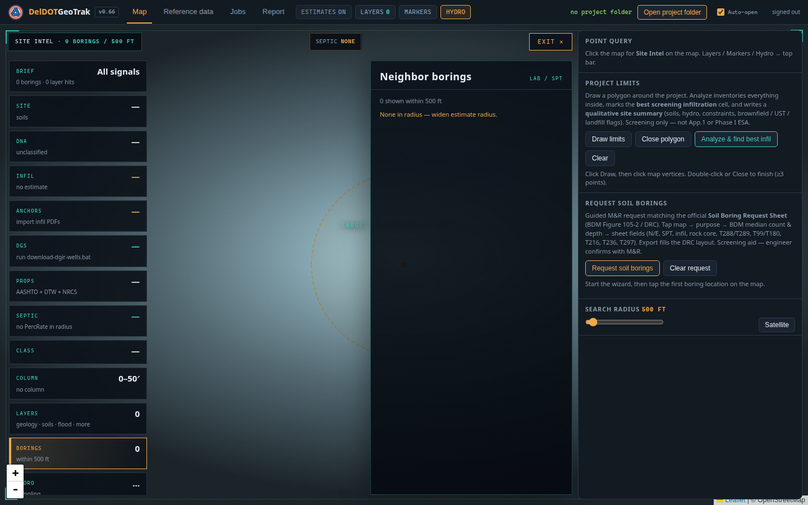
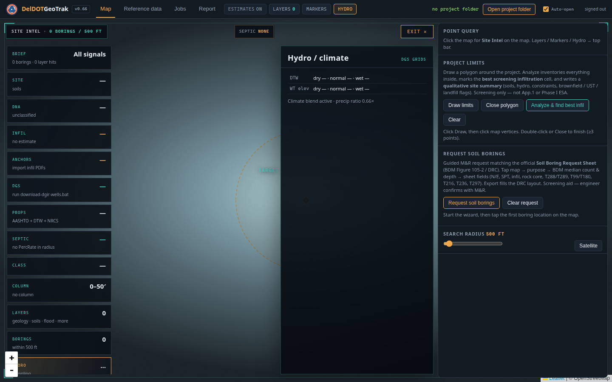

---

## 5. Reference data tab

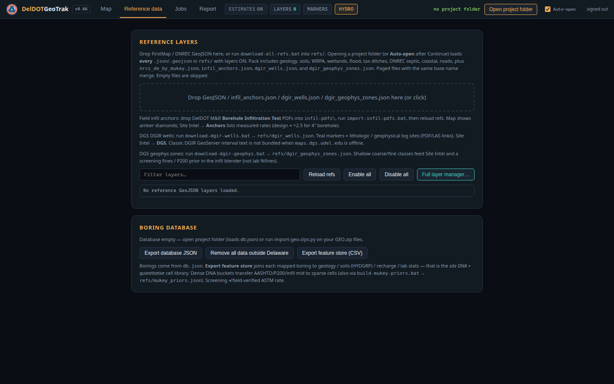

### Reference layers box
| Box / button | Meaning | What you do |
|--------------|---------|-------------|
| Drop zone | Add GeoJSON / anchors / DGS files | Drop files or click |
| Batch download hint | `download-all-refs.bat` fills `refs/` | Run on your PC, then Open project folder |
| Infil PDF hint | Import measured borehole tests | Drop PDFs in `infil-pdfs\`, run `import-infil-pdfs.bat` |
| DGS hints | Wells + geophys zones | Run the download `.bat` scripts |
| **Filter layers…** | Search loaded layer names | Type |
| **Reload refs** | Re-read from the project folder | Click after scripts finish |
| **Enable all / Disable all** | Turn layers on/off for Site Intel | Click |
| **Full layer manager…** | Bigger checklist | Enable only what you need |

### Boring database box
| Box / button | Meaning | What you do |
|--------------|---------|-------------|
| Status line | Empty vs loaded `db.json` | Open project folder or import jobs/zips |
| **Export database JSON** | Download the boring DB | Backup / share |
| **Remove all data outside Delaware** | Purge out-of-state points | Use carefully |
| **Export feature store (CSV)** | Build DNA + lab cell library for analogs | Run after borings + soils/geology are loaded |

---

## 6. Jobs tab

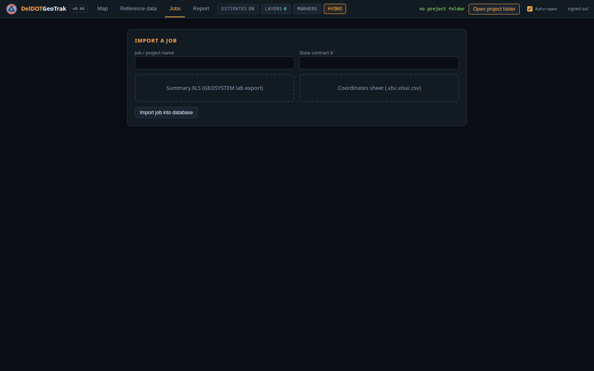

| Box | Meaning | What you do |
|-----|---------|-------------|
| Job / project name | Name in the database | Type |
| State contract # | Contract identifier | Type |
| Summary.XLS drop | GEOSYSTEM lab export | Drop the file |
| Coordinates drop | Boring X/Y sheet | Drop .xls / .xlsx / .csv |
| Boring / X / Y / CRS | Column mapping | Pick columns; CRS = DE State Plane ft or Lat/Lon |
| **Import job into database** | Merge into local `db.json` | Click |

---

## 7. Report tab

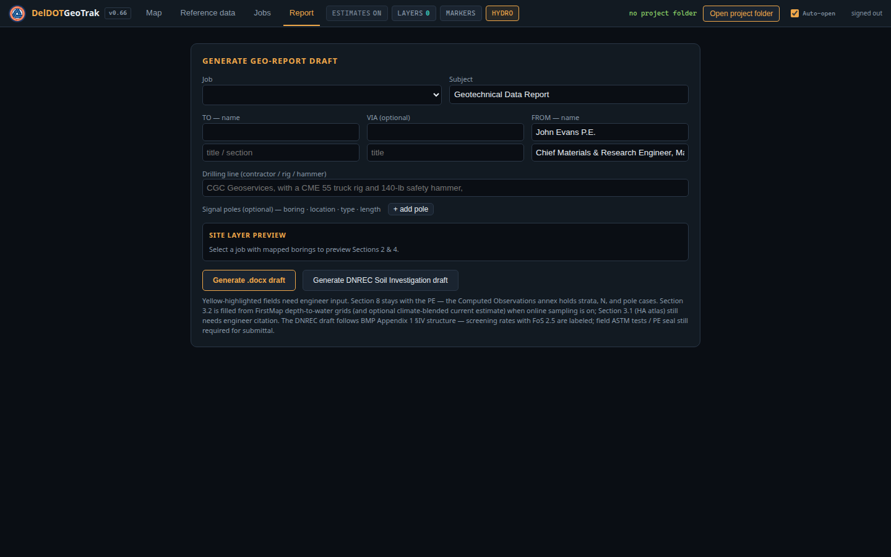

| Box | Meaning | What you do |
|-----|---------|-------------|
| Job select | Which job to write about | Pick a mapped job |
| Subject / TO / VIA / FROM | Memo header | Fill |
| Drilling line | Contractor / rig / hammer text | Fill |
| **+ add pole** | Optional signal-pole rows | Add if needed |
| Site layer preview | Auto geology/hydro preview | Check |
| **Generate .docx draft** | DelDOT-style geo memo draft | Download; yellow = engineer still fills |
| **Generate DNREC Soil Investigation draft** | BMP App.1 §IV-shaped draft | Screening rates labeled; PE seal / field tests still required |

---

## Typical workflows

### A) Screen a BMP location for infiltration
1. Open project folder · Estimates **ON** · Hydro online on  
2. Click the proposed facility on the map  
3. Open **Infil** → read “How we arrived at this rate”  
4. Check **Hydro** (≥2 ft to water?) and **Layers** (GMZ / wetland / LUST?)  
5. If an amber **Anchor** is nearby, trust it over map guesses  
6. Schedule real ASTM field tests before design  

### B) Draw project limits and find the best cell
1. Estimates **ON**  
2. **Draw limits** → click vertices → **Close polygon**  
3. **Analyze & find best infil**  
4. Read the qualitative site summary · open Site Intel at the best marker  

### C) Request borings for a bridge / pole / SWM
1. **Request soil borings** → tap locations  
2. Pick purpose (controls depth, rock core, continuous SPT)  
3. Review contact (default M&R: Aaron Wieczorek) and tests  
4. Export the sheet · engineer confirms with M&R  

### D) Import a new job’s lab data
1. **Jobs** tab → drop Summary + Coordinates → map columns → Import  
2. **Map** → click near the borings → **Borings** / **Class** / **Infil**  

---

## Local folder layout (for full power)

```
your-project/
  db.json                 ← boring + lab database
  refs/                   ← FirstMap / DNREC GeoJSON, NRCS props, DGS packs
  infil-pdfs/             ← DelDOT borehole infil PDFs (optional)
  Geo_Report_Center.html  ← optional local copy of the app
```

Helpful scripts in this repo folder:

| Script | Purpose |
|--------|---------|
| `download-all-refs.bat` | Pull public reference GeoJSON packs into `refs/` |
| `import-infil-pdfs.bat` | Build `infil_anchors.json` from PDFs |
| `download-dgir-wells.bat` / `download-dgir-geophys.bat` | DGS well inventory / geophys zones |
| `import-geo-zips.bat` | Build/refresh boring DB from GEO.zip packs |
| `build-feature-store.bat` / `build-mukey-priors.bat` | DNA / analog libraries |

---

## Auth troubleshooting

| Symptom | Likely cause | Fix |
|---------|--------------|-----|
| Failed to fetch | Opened as `file://`, or bad/dead project URL | Use the https Pages link; Connection settings → Test / Reset to LabTrak project |
| Wrong email or password (but LabTrak password is right) | GeoTrak pointed at a **different** empty Supabase project | **Reset to LabTrak project**, then sign in |
| LabTrak and GeoTrak disagree | Different URL/key saved in the browser | Save once in either app (they sync), or Reset |

---

## Honesty labels (read these once)

- **Screening / Estimates** = planning aid.  
- **Illustrative design ÷2.5** = borehole-path planning number, not preferred full-size ring approval.  
- **DNA transfer** fills gaps; it does **not** move contamination / GMZ / wetland flags.  
- **Boring request** drafts the M&R sheet; it does not replace engineer judgment.  
- **Hosted page** needs your local project folder for the full Delaware data pack.

---

## For developers / maintainers

- Single-file app: `Geo_Report_Center.html` (do not rename).  
- GitHub Pages publishes from `main` → https://m3nos95.github.io/Geotrack/geotrak/  
- Deeper technical write-ups: `DelDOT_GeoTrak_How_We_Built_It.md`, `DelDOT_GeoTrak_Technical_White_Paper.md`  
- Regenerate screenshots (optional):

```bash
cd geo-report-center
node docs/capture-readme-shots.cjs
```

(Requires Chrome / Chromium and `puppeteer-core`.)
